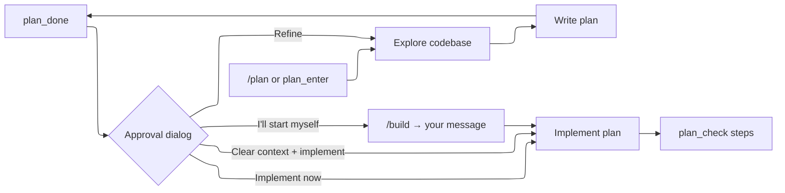

# Plan Mode

Plan mode restricts the agent to exploration and planning — it can read files and produce a structured plan, but cannot execute code, write files, or run arbitrary shell commands.

## Workflow



1. **Enter plan mode** — type `/plan` or the agent suggests it via `plan_enter`
2. **Explore** — the agent reads files, runs read-only shell commands, and analyzes the codebase
3. **Write plan** — the agent produces a structured markdown plan with a checklist
4. **Review** — the agent signals completion with `plan_done`; the full plan file path is shown (cmd-click to open it in your editor)
5. **Approve** — when the turn ends, an approval dialog opens: implement now, clear context and implement (the plan survives in the system prompt, the exploration chatter doesn't), approve and start yourself, or refine — the refine option asks what should change and sends the feedback straight back to planning. `/build` remains as the manual gesture
6. **Implement** — the agent works through the plan, checking off steps with `plan_check`

Declining the agent's own `plan_enter` suggestion is safe: the session auto-continues in build mode.

## What's Allowed in Plan Mode

### Read-Only Bash

Only inspection commands are allowed. The allowlist includes:

`ls`, `cat`, `head`, `tail`, `wc`, `grep`, `rg`, `fd`, `find`, `file`, `stat`, `du`, `df`, `tree`, `diff`, `sort`, `uniq`, `cut`, `nl`, `realpath`, `dirname`, `basename`, `which`, `pwd`, `echo`, `printf`, `date`, `column`, `strings`, `jq`, `yq`

Git read-only subcommands: `log`, `show`, `diff`, `status`, `blame`, `rev-parse`, `ls-files`, `ls-tree`, `ls-remote`, `shortlog`, `describe`, `grep`, `reflog`, `cat-file`, `count-objects`

### Blocked

- Output redirection (`>`)
- Command and process substitution (`$()`, backticks, `<()`)
- Any binary not on the allowlist (`env` included — it launches arbitrary binaries; same for test runners and package managers)
- Argument-level writers on allowlisted binaries: `find -delete`/`-exec`, `fd -x`, `sort -o`, `tree -o`, `--output`, `uniq in out`
- `write`, `edit` tools

`web_search`/`web_fetch` follow the `/web` toggle in both modes — plan mode doesn't change them.

## Plan Tools

| Tool | Mode | Description |
|------|------|-------------|
| `plan_write` | Plan | Write or replace a named plan file |
| `plan_edit` | Plan | Edit a section by heading |
| `plan_read` | Both | Read plan content and headings |
| `plan_done` | Plan | Signal plan is ready for review |
| `plan_discard` | Plan | Delete a plan |
| `plan_enter` | Build | Suggest switching to plan mode |
| `plan_check` | Build | Mark a checklist item as done |

## Plan Files

Plans are stored as markdown files:

```
~/.cast/plans/<session-id>/
  auth-refactor.md
  database-migration.md
```

One directory per session. Multiple named plans can exist in a session.

### Plan Format

Plans use markdown with sections. The recommended structure:

```markdown
## Context

Why this work is needed.

## Steps

- [ ] Step 1: Do the first thing
- [ ] Step 2: Do the second thing
- [ ] Step 3: Verify

## Verification

How to confirm the changes work.

## Assumptions

Any assumptions made during planning.
```

The checklist (`- [ ]`) format is important — `plan_check` marks items as `- [x]` and tracks progress.

## Commands

| Command | Description |
|---------|-------------|
| `/plan` | Enter plan mode |
| `/build` | Exit plan mode, restore full toolset |
| `/plan-model [name\|off]` | Model used while plan mode is active |

Mode switching is rejected while a run is active — modes flip only between runs.

`/build` with an existing plan is the approval gesture — the plan is injected into the build-mode system prompt so the agent's next message starts implementation guided by it.

## What the Model Sees

### Plan Mode

When plan mode is active, a restriction block is prepended to the system prompt:

```
══════════════════════════════════════════════
PLAN MODE ACTIVE — no changes allowed
══════════════════════════════════════════════
You are in plan mode: read, search, and think — change nothing.

Restrictions:
- write and edit are unavailable
- bash is INSPECTION-ONLY (allowlisted read-only binaries)
- You cannot switch modes yourself
```

The model is instructed to: understand the task → explore the codebase → write a plan → call `plan_done`.

### Build Mode

When you type `/build` with an approved plan, the plan is injected into the system prompt:

```
An approved plan exists for this task. It was written in plan mode and reviewed by the user:

<plan>
[plan content]
</plan>

Follow the plan step by step. Right after completing each step, mark it done with plan_check.
```

The plan stays in the system prompt across turns and survives compaction — it's re-read from disk on each run.

### Plan Fully Executed

Once every checklist item is checked, the plan is replaced with a brief reference:

```
The approved plan "name" for this task has been fully executed — every checklist
item is checked. It no longer steers the work; treat new requests on their own terms.
```

## Per-Phase Model

`/plan-model` sets a model used only while plan mode is active (stored as `planModel` in settings, like `subagentModel`). The typical split: an expensive high-quality model for planning, a cheap one for building, a fast one for sub-agents. The status bar, the system prompt `Model:` line, and the actual requests all report the model in use; `/plan-model off` returns plan mode to the main model.

## Plan Mode Persistence

The plan mode state is per-session. If you quit mid-planning and resume the session, the mode is restored. A fresh session always starts in build mode.
